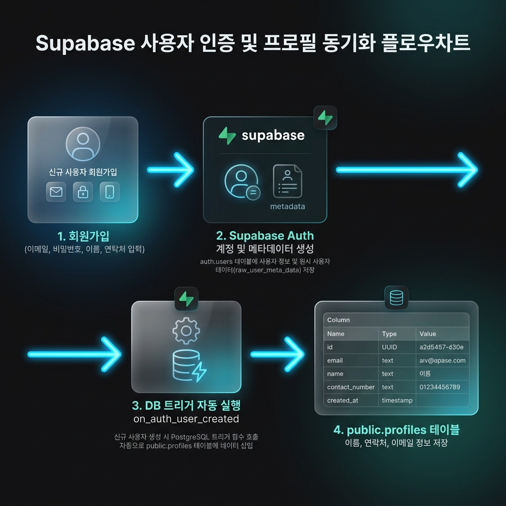
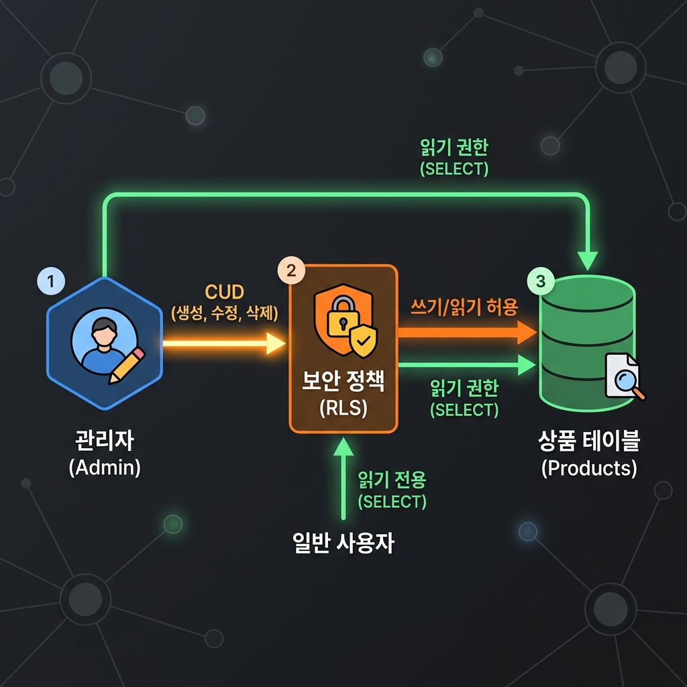

# 🐾 펫플래닛 (Pet Planet) - 프리미엄 반려동물 용품 & 특화간식 전문 스토어

> **AI 기반 프롬프트 블루프린팅 설계와 Supabase 백엔드를 결합하여 제작한 맞춤형 풀스택 펫 커머스 플랫폼**

펫플래닛은 단순한 쇼핑몰을 넘어, 반려동물의 세부 품종과 만성 질환(슬개골 탈구, 눈물샘, 알레르기, 비만 등)을 진단하여 맞춤형 식단 및 처방 수제 간식을 제안하고 구매할 수 있는 프리미엄 이커머스 서비스입니다.

---

## 🌟 주요 핵심 기능

### 1. 지능형 이중 카테고리 필터링
* **1차 대분류 필터 (강아지 / 고양이)** 및 **2차 소분류 필터 칩**을 동적으로 매핑하여 사용자가 찾고자 하는 용품군에 간편하게 접근할 수 있도록 UI를 구축했습니다.

### 2. 반려동물 건강 진단 및 맞춤 처방 플래너
* 반려동물 종류와 품종, 예방 또는 케어가 필요한 주요 고민(관절, 눈물, 피부 알레르기, 체중 조절 등)을 입력하면 즉석에서 **수의사 검증 급여 가이드라인**과 함께 **맞춤형 처방 간식 조합**을 실시간으로 화면에 렌더링합니다.

### 3. Supabase Auth 및 DB 연동 (보안 중심 풀스택)
* **보호자 정보 동기화**: 회원가입 시 입력된 보호자 이름과 연락처는 Supabase Auth 메타데이터를 거쳐 데이터베이스 내부 **Triggers & Functions**에 의해 `public.profiles` 테이블로 실시간 자동 이전됩니다.
* **보안 기능 (RLS & RPC)**: Row Level Security 정책을 적용하여 사용자는 오직 자신의 프로필만 안전하게 조회/수정할 수 있으며, 회원 탈퇴 및 본인 인증 비밀번호 변경 등 민감한 동작은 PostgreSQL RPC(보안 함수)를 통해 안전하게 수행됩니다.

#### 👤 A. 회원 정보 관리 흐름 (인증 & 프로필 동기화)
* **흐름 설명**: 사용자가 회원가입 시 이메일, 비밀번호와 함께 보호자 이름 및 연락처를 입력하면, 해당 정보가 `Supabase Auth`에 안전하게 등록됩니다. 이후 데이터베이스 내부 트리거(`on_auth_user_created`)가 즉시 실행되어 `public.profiles` 테이블에 유저 고유 ID와 함께 이름, 연락처, 이메일 정보가 안전하게 복사 및 동기화됩니다.



#### 📦 B. 상품 관리 및 보안 제어 흐름 (RLS 적용)
* **흐름 설명**: 관리자가 상품을 새로 등록하거나 품절 처리/삭제하면, `public.products` 테이블에 실시간으로 데이터가 저장 및 반영됩니다. 이때 테이블에 활성화된 **RLS (Row Level Security)** 정책에 의해, 로그인하지 않은 방문자 및 일반 사용자는 오직 상품 조회(SELECT)만 가능하며, 관리자 권한을 가진 세션만 상품의 등록/수정/삭제 권한을 획득하도록 완벽하게 보호됩니다.



### 4. 고도화된 관리자(Admin) 권한 및 실시간 관리 제어
* **관리자 전용 제어 패널**: 관리자(Admin) 계정으로 로그인하면 상품 카드 하단에 전용 제어 패널이 노출됩니다.
* **실시간 품절 처리 (Sold Out)**: 버튼 클릭 한 번으로 DB의 `is_sold_out` 상태를 토글하며, 품절 시 카드에 흑백 필터와 함께 프리미엄 **'SOLD OUT'** 도장 스탬프 효과가 적용되고 장바구니 구매가 차단됩니다. 상세 정보 페이지 또한 자동으로 품절 알림 배너가 띄워지고 장바구니 버튼이 막힙니다.
* **실시간 상품 삭제 (Delete)**: 상품을 삭제하면 Supabase DB 및 홈 카탈로그 목록에서 즉시 영구 제거됩니다.

## ⚙️ Supabase 작동 및 백엔드 데이터 흐름 (Supabase Workflows)

스토어의 로그인, 정보 조회, 그리고 관리자 기능은 다음과 같이 Supabase 백엔드 서비스를 기반으로 완전히 자동화 및 암호화되어 안전하게 처리됩니다.

### 1. 회원 정보 연동 및 동기화 (Auth & Trigger)
* **단계 1. 회원가입 양식 제출**: 클라이언트에서 보호자의 '이메일, 비밀번호, 이름, 연락처'를 담아 `supabase.auth.signUp()`을 호출합니다.
* **단계 2. Supabase Auth 계정 생성**: 입력 정보 검증 후 Supabase가 회원 계정을 생성하고, 이름과 연락처는 인증용 메타데이터 필드(`raw_user_meta_data`)에 임시로 적재합니다.
* **단계 3. PostgreSQL 트리거 (`handle_new_user()`) 자동 구동**: 
  * 계정이 생성되는 순간, DB 트리거 `on_auth_user_created`가 자동으로 가동됩니다.
  * 트리거 함수가 메타데이터 속에서 이름과 연락처를 추출한 뒤, `public.profiles` 테이블에 신규 행으로 자동 입력합니다.
* **단계 4. 프로필 정보 조회**: 로그인 후 클라이언트가 자신의 고유 ID로 `profiles` 테이블을 조회하여 최신 가입 정보(이름, 휴대폰 번호)를 로드합니다.

### 2. 보안 데이터 격리 및 권한 제한 (Row Level Security)
데이터베이스의 불법적인 조작 및 타인의 개인정보 조회를 차단하기 위해 **RLS (Row Level Security)** 정책을 적용하여 브라우저 API 통신 시 권한을 철저히 검증합니다.
* **사용자 프로필 (`profiles` 테이블)**: 
  * 사용자는 오직 본인의 고유 ID에 해당하는 행만 조회 및 수정할 수 있습니다 (`auth.uid() = id`). 타인의 이메일이나 전화번호 조회가 원천적으로 차단됩니다.
* **상품 데이터 (`products` 테이블)**:
  * 일반 사용자 및 비로그인 방문자: 누구나 상품 목록을 조회할 수 있도록 자유로운 조회(`SELECT`) 정책만 허용됩니다.
  * 관리자(Admin): 로그인 세션의 이메일이 `admin@petplanet.co.kr`이거나 JWT 토큰 메타데이터의 역할(`role`)이 `admin`으로 확인된 경우에만 상품 추가(`INSERT`), 정보/품절 수정(`UPDATE`), 상품 삭제(`DELETE`) 정책을 통과하여 데이터를 제어할 수 있습니다.

### 3. 클라이언트 노출이 차단된 안전한 비즈니스 로직 (RPC 보안 함수)
민감한 연산 및 고권한(Superuser) 작업은 브라우저 상의 Javascript 코드가 아닌, Supabase 클라우드 데이터베이스 서버 내부에 격리된 **보안 함수(RPC)**를 호출하여 처리합니다.
* **안전한 이메일(아이디) 찾기 (`find_email_by_name_and_phone`)**: 
  * 브라우저에서 이름과 연락처를 암호화 파라미터로 넘겨 이 함수를 호출하면, 데이터베이스 서버가 직접 매칭되는 행을 연산하여 매핑된 이메일을 반환합니다. 클라이언트에 전체 profiles 테이블을 노출하지 않고 안전하게 연산합니다.
* **비밀번호 강제 재설정 (`reset_password_by_identity`)**:
  * 아이디, 이름, 연락처의 3가지 본인인증 조건이 일치하는 경우 데이터베이스 내부에서 `pgcrypto` 확장 모듈의 `crypt()` 및 `gen_salt('bf')` 암호화 알고리즘을 사용해 사용자 비밀번호를 다이렉트로 업데이트합니다.
* **안전한 계정 삭제 (`delete_own_account`)**:
  * 사용자가 회원 탈퇴를 요청하면, 서버 사이드 함수가 구동되어 `auth.users` 테이블에서 본인 계정을 즉시 삭제하며, 관계형 제약조건(`ON DELETE CASCADE`)에 따라 프로필 정보까지 연쇄적으로 깨끗하게 지워집니다.

---

## 🛠️ 기술 스택 상세 (Tech Stack Details)

### 1. Frontend (프론트엔드)
* **HTML5 & ESM (ECMAScript Modules)**: 
  * 별도의 무거운 프레임워크 없이 모듈러 자바스크립트(`import / export`) 아키텍처를 적용했습니다.
  * [supabase-client.js](file:///c:/Users/yyyuu/Desktop/store/supabase-client.js)에 선언된 공통 API 함수들을 [app.js](file:///c:/Users/yyyuu/Desktop/store/app.js) 및 [product-detail.js](file:///c:/Users/yyyuu/Desktop/store/product-detail.js)에서 유기적으로 호출하여 코드 재사용성을 극대화했습니다.
* **Vanilla CSS3 (Custom Design System)**:
  * `:root` 가상 클래스 선택자(Pseudo-class)를 활용하여 레이아웃 여백, 테두리 반경(`border-radius`), 색상 스키마(주색, 보조색, 경고, 오류) 등 전역 전용 디자인 토큰을 정의해 일관된 테마를 유지했습니다.
  * **Glassmorphic UI**: `backdrop-filter` 속성을 가미해 반투명 유리 질감의 카드 및 드롭다운 메뉴를 연출, 프리미엄한 감성의 디자인을 완성했습니다.
  * **반응형 웹 그리드**: CSS Grid와 Flexbox를 적극 사용하여 모바일 기기부터 데스크톱 해상도까지 유연하게 대응하는 그리드 시스템을 탑재했습니다.

### 2. Backend & Database (백엔드 및 데이터베이스)
* **Supabase Client SDK (Serverless)**:
  * ESM CDN 라이브러리를 통해 초기 로딩 성능을 최적화했으며, 단일 `createClient` 인스턴스로 회원 인증 및 테이블 조작을 연동했습니다.
* **PostgreSQL Database**:
  * **Profiles Table**: 유저 정보(이름, 휴대폰 번호, 이메일)를 담는 profiles 관계형 테이블을 구축하여 데이터 연동을 수행합니다.
  * **Products Table**: 상품 카탈로그 및 어드민 품절 여부(`is_sold_out`)를 저장하는 테이블로, 실시간 상품 데이터를 제어합니다.
* **Database Trigger (데이터 동기화 자동화)**:
  * 가입(`auth.users` 테이블 계정 생성)이 일어나는 순간 실행되는 PL/pgSQL 트리거 함수(`handle_new_user()`)를 설치하여, 보호자 이름과 휴대폰 메타데이터가 `public.profiles` 테이블로 실시간 즉시 복사 및 적재되도록 자동화했습니다.
* **Row Level Security (RLS) 정책**:
  * 사용자가 본인의 프로필(`auth.uid() = id`) 정보만 읽고 쓸 수 있게 차단하는 강력한 보안 정책을 수립했습니다.
  * 상품 등록/수정/삭제 정책을 세분화하여, 오직 관리자 권한을 소유한 세션(이메일 검증 및 역할 메타데이터 `admin` 확인)만 쓰기 연산을 허용하고 일반 고객은 오직 조회(SELECT)만 가능하도록 격리했습니다.
* **RPC (Stored Procedure - 보안 함수)**:
  * 사용자 본인의 계정 즉시 탈퇴(`delete_own_account`), 안전한 아이디 찾기(`find_email_by_name_and_phone`), 3가지 조건 일치 시 비밀번호 암호화 업데이트(`reset_password_by_identity`) 등 민감한 비즈니스 로직을 데이터베이스 서버 내부에 보안 프로시저로 격리하여 클라이언트 공격 노출을 원천 방지했습니다.

### 3. Bundler & Development Tooling (개발 도구)
* **Vite**:
  * ESM 방식의 초고속 로컬 HMR(Hot Module Replacement) 개발 서버를 활용하여 코딩 시 실시간 변화를 브라우저에 0.1초 만에 갱신 및 반영하며, Rollup 번들러를 이용해 상용 프로덕션 번들을 효율적으로 최적화합니다.

---

## 🚀 시작하기 & 세팅 방법

### 1. Supabase 데이터베이스 설정 (DDL 실행)
Supabase 프로젝트 대시보드 접속 후 **SQL Editor**에서 `supabase_setup.sql` 파일의 내용을 붙여넣고 실행해 주세요.
* 회원가입 데이터 연동용 `profiles` 테이블 및 트리거 함수 설치
* 상품 관리 및 품절 필드가 포함된 `products` 테이블 구조와 RLS 정책 적용
* 비밀번호 변경, 회원탈퇴를 위한 RPC 보안 함수 자동 생성

### 2. 로컬 실행 방법
프로젝트 루트 디렉토리에서 다음 명령어를 실행하여 실행할 수 있습니다:

```bash
# 의존성 패키지 설치
npm install

# 로컬 개발 서버 구동 (Vite)
npm run dev
```

---

## 💡 개발 방법론 & 프롬프트 전략
이 프로젝트는 안드레이 카파시(Andrej Karpathy)의 *"영어는 현재 가장 핫한 프로그래밍 언어다"*라는 철학을 실현하기 위해 **프롬프트 블루프린팅(Prompt Blueprinting) 설계 기법**을 적용하여 개발되었습니다.

개발 과정 전반에 직접 참여한 상세 프롬프트 이력(기획 설계, 백엔드 RLS 정책 명세, 어드민 권한 고도화 요건 등)은 로컬의 `prompts.txt` 파일에 체계적으로 기록되어 있습니다.
