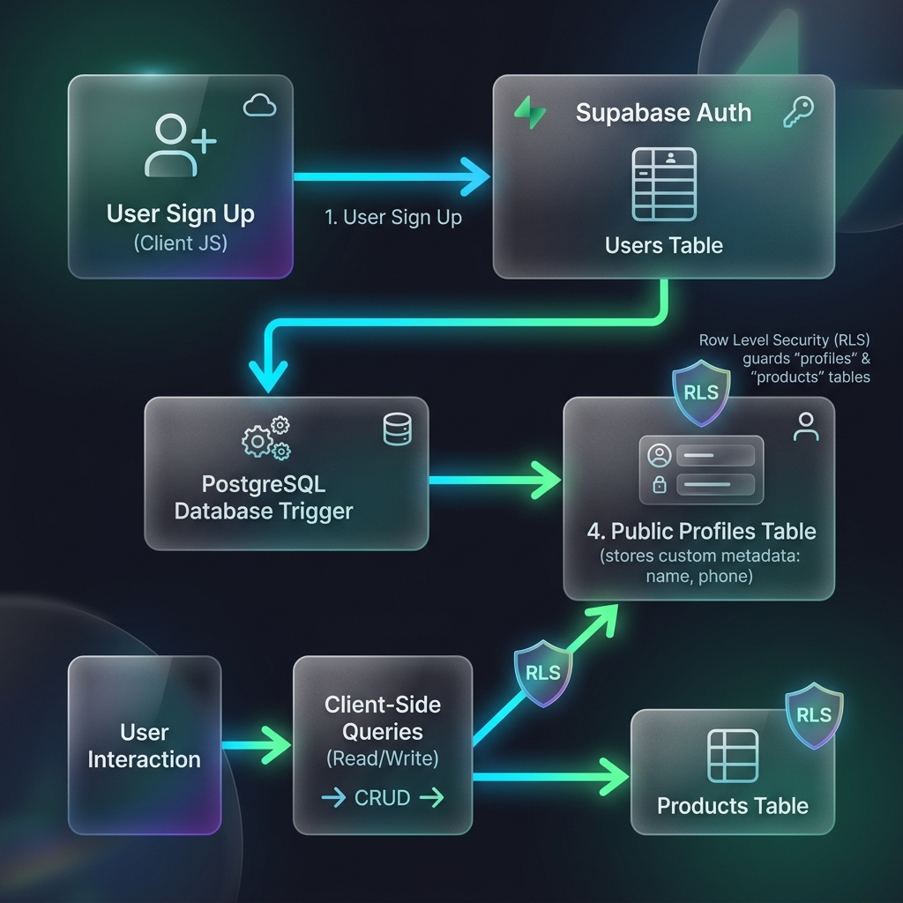

# 🐾 펫플래닛 (Pet Planet) - 프리미엄 반려동물 용품 & 특화간식 전문 스토어

> **AI 기반 프롬프트 블루프린팅 설계와 Supabase 백엔드를 결합하여 제작한 맞춤형 풀스택 펫 커머스 플랫폼**

펫플래닛은 단순한 쇼핑몰을 넘어, 반려동물의 세부 품종과 만성 질환(슬개골 탈구, 눈물샘, 알레르기, 비만 등)을 진단하여 맞춤형 식단 및 처방 수제 간식을 제안하고 구매할 수 있는 프리미엄 이커머스 서비스입니다.

---

## 🌟 주요 핵심 기능

### 1. 지능형 이중 카테고리 필터링
* **1차 대분류 필터 (강아지 / 고양이)** 및 **2차 소분류 필터 칩**을 동적으로 매핑하여 사용자가 찾고자 하는 용품군에 간편하게 접근할 수 있도록 UI를 구축했습니다.

### 2. 반려동물 건강 진단 및 맞춤 처방 플래너
* 반려동물 종류와 품종, 예방 또는 케어가 필요한 주요 고민(관절, 눈물, 피부 알레르기, 체중 조절 등)을 입력하면 즉석에서 **수의사 검증 급여 가이드라인**과 함께 **맞춤형 처방 간식 조합**을 실시간으로 화면에 렌더링합니다.

### 3. Supabase Auth 및 DB 연동 (보안 중심 풀스택)
* **보호자 정보 동기화**: 회원가입 시 입력된 보호자 이름과 연락처는 Supabase Auth 메타데이터를 거쳐 데이터베이스 내부 **Triggers & Functions**에 의해 `public.profiles` 테이블로 실시간 자동 이전됩니다.
* **보안 기능 (RLS & RPC)**: Row Level Security 정책을 적용하여 사용자는 오직 자신의 프로필만 안전하게 조회/수정할 수 있으며, 회원 탈퇴 및 본인 인증 비밀번호 변경 등 민감한 동작은 PostgreSQL RPC(보안 함수)를 통해 안전하게 수행됩니다.

#### ⚙️ Supabase 연동 아키텍처 다이어그램


### 4. 고도화된 관리자(Admin) 권한 및 실시간 관리 제어
* **관리자 전용 제어 패널**: 관리자(Admin) 계정으로 로그인하면 상품 카드 하단에 전용 제어 패널이 노출됩니다.
* **실시간 품절 처리 (Sold Out)**: 버튼 클릭 한 번으로 DB의 `is_sold_out` 상태를 토글하며, 품절 시 카드에 흑백 필터와 함께 프리미엄 **'SOLD OUT'** 도장 효과가 적용되고 장바구니 구매가 차단됩니다. 상세 정보 페이지 또한 자동으로 품절 알림 배너가 띄워지고 장바구니 버튼이 막힙니다.
* **실시간 상품 삭제 (Delete)**: 상품을 삭제하면 Supabase DB 및 홈 카탈로그 목록에서 즉시 영구 제거됩니다.

---

## 🛠️ 기술 스택 (Tech Stack)

* **Frontend**: HTML5, Vanilla CSS3 (Custom Design System, Glassmorphic Glass-UI), ESM Javascript
* **Backend & DB**: Supabase (Authentication, PostgreSQL, Row Level Security, RPC Functions & Trigger)
* **Bundler & Tooling**: Vite

---

## 🚀 시작하기 & 세팅 방법

### 1. Supabase 데이터베이스 설정 (DDL 실행)
Supabase 프로젝트 대시보드 접속 후 **SQL Editor**에서 `supabase_setup.sql` 파일의 내용을 붙여넣고 실행해 주세요.
* 회원가입 데이터 연동용 `profiles` 테이블 및 트리거 함수 설치
* 상품 관리 및 품절 필드가 포함된 `products` 테이블 구조와 RLS 정책 적용
* 비밀번호 변경, 회원탈퇴를 위한 RPC 보안 함수 자동 생성

### 2. 로컬 실행 방법
프로젝트 루트 디렉토리에서 다음 명령어를 실행하여 실행할 수 있습니다:

```bash
# 의존성 패키지 설치
npm install

# 로컬 개발 서버 구동 (Vite)
npm run dev
```

---

## 💡 개발 방법론 & 프롬프트 전략
이 프로젝트는 안드레이 카파시(Andrej Karpathy)의 *"영어는 현재 가장 핫한 프로그래밍 언어다"*라는 철학을 실현하기 위해 **프롬프트 블루프린팅(Prompt Blueprinting) 설계 기법**을 적용하여 개발되었습니다.

개발 과정 전반에 직접 참여한 상세 프롬프트 이력(기획 설계, 백엔드 RLS 정책 명세, 어드민 권한 고도화 요건 등)은 로컬의 `prompts.txt` 파일에 체계적으로 기록되어 있습니다.
